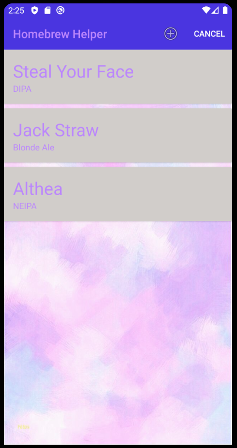
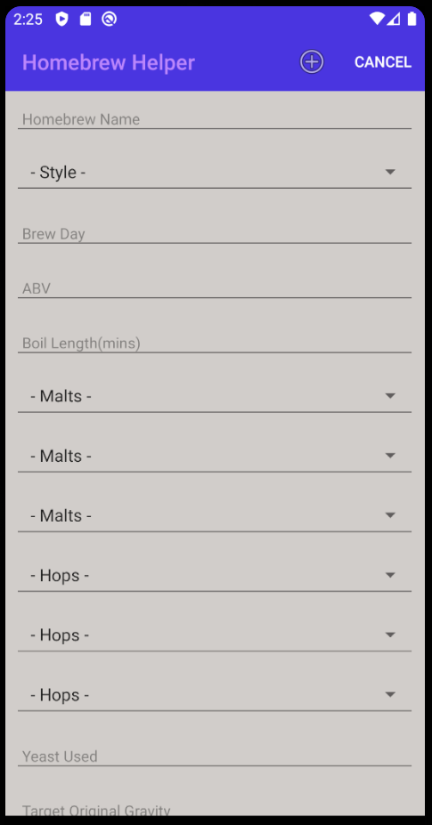

# Android-Homebrew
Kotlin app to store Homebrews. Mobile App Development I Assignment 2

Full CRUD functionality plus JSON persistence. 

Store homebrew details such as the Name, style, different malts and hops used, and more.

Upload an image of the homebrew, plus adding notes to how the brew went

## Main View

## Add New Homebrew Menu

